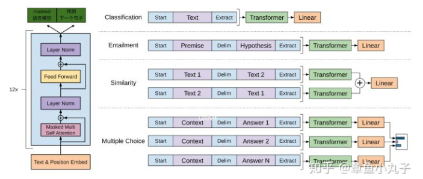

# Google BERT model

### 概述
BERT的全称是Bidirectional Encoder Representation from Transformers，本质是一个语言编码器，把输入的句子或者段落转化成特征向量（embedding）。模型的创新在于
- 双向编码器。作者沿用了《attention is all you need》里提到的语言编码器，并提出双向的概念，利用masked语言模型实现双向。
- 提出了两种预训练的方法Masked语言模型和下一个句子的预测方法。作者认为现在很多语言模型低估了预训练的力量。Masked语言模型比起预测下一个句子的语言模型，多了双向的概念。

### 模型框架
BERT模型复用OpenAI发布的《Improving Language Understanding with Unsupervised Learning》里的框架，BERT整体模型结构与参数设置都尽量做到OpenAI GPT一样，只在预训练方法做了改造。而GPT让编码器只学习每一个token(单词）与之前的相关内容。

整体分为两个过程：
- 预训练过程 pre-training（左边图）预训练过程是一个multi-task learning，迁移学习的任务，目的是学习输入句子的向量。
- 微调过程 fine-tuning（右边图）可基于少量监督学习样本，加入Feedword神经网络，实现目标。因为微调阶段学习目标由简单的feedward神经网络构成，且用少量标注样本，所以训练时间短。

#### 输入表示

Bert模型对输入做了更宽泛的定义，输入表示即可以是一个句子也可以一对句子（比如问答和答案组成的问答对）.
- 输入表示最终为每个词对应的词向量，segment向量，位置向量相加而成。
- 位置向量的定义请参见《Attention is all you need》.

#### 预训练 Masked LM 
Masked语言模型是为了训练深度双向语言表示向量，作者用了一个非常直接的方式，遮住句子里某些单词，让编码器预测这个单词是什么。

训练方法为：作者随机遮住15%的单词作为训练样本。
- 其中80%用masked token来代替。
- 10%用随机的一个词来替换。
- 10%保持这个词不变。

作者在论文中提到这样做的好处是，编码器不知道哪些词需要预测的，哪些词是错误的，因此被迫需要学习每一个token的表示向量。另外作者表示，每个batchsize只有15%的词被遮盖的原因，是性能开销。双向编码器比单项编码器训练要慢。

#### 预测下一个句子
预训练一个二分类的模型，来学习句子之间的关系。预测下一个句子的方法对学习句子之间关系很有帮助。

训练方法：正样本和负样本比例是1：1，50%的句子是正样本，随机选择50%的句子作为负样本。

#### 预训练阶段参数
本文提出了两个大小的模型，分别是

- BERT-Base: L = 12, H = 768, A = 12, Total parameters = 110M
- BERT-Large: L = 24, H = 1024, A = 16, Total parameters = 340M
其中L表示Transformer层数，H表示Transformer内部维度，A表示Heads的数量

#### 微调阶段
微调阶段根据不同任务使用不同网络模型。在微调阶段，大部分模型的超参数跟预训练时差不多，除了batchsize，学习率，epochs。

### Reference
- [NLP突破性成果 BERT 模型详细解读](https://zhuanlan.zhihu.com/p/46997268)
- [论文解读:BERT模型及fine-tuning](https://zhuanlan.zhihu.com/p/46833276)