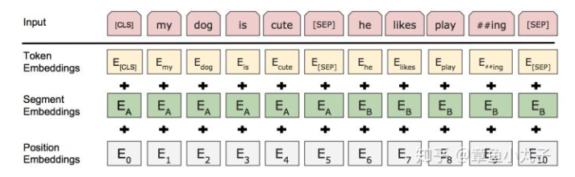

# Google BERT model

### 常用的语言与训练方法
长期以来，词向量一直都是NLP任务中的主要表征技术。随着2017年以来的乙烯利诶技术突破，研究证实预训练的语言表征经过精调后可以在众多NLP任务中达到更好的表现。目前预训练有两种方法：
- Feature-based：将训练出的representation作为feature用于任务，从词向量、句向量、段向量、文本向量都是这样的。新的ELMo也属于这类，但迁移后需要重新计算出输入的表征。
- Fine-tuning：在预训练好的模型上加些针对任务的层，再对后几层进行精调。新的ULMFit和OpenAI GPT属于这一类。

### BERT 概述
BERT的全称是Bidirectional Encoder Representation from Transformers，本质是一个语言编码器，把输入的句子或者段落转化成特征向量（embedding）。模型的创新在于
- 双向编码器。作者沿用了《attention is all you need》里提到的语言编码器，并提出双向的概念，利用masked语言模型实现双向。
- 提出了两种预训练的方法Masked语言模型和下一个句子的预测方法。作者认为现在很多语言模型低估了预训练的力量。Masked语言模型比起预测下一个句子的语言模型，多了双向的概念。

### 模型框架
BERT模型复用OpenAI发布的《Improving Language Understanding with Unsupervised Learning》里的框架，BERT整体模型结构与参数设置都尽量做到OpenAI GPT一样，只在预训练方法做了改造。而GPT让编码器只学习每一个token(单词）与之前的相关内容。


整体分为两个过程：
- 预训练过程 pre-training（左边图）预训练过程是一个multi-task learning，迁移学习的任务，目的是学习输入句子的向量。
- 微调过程 fine-tuning（右边图）可基于少量监督学习样本，加入Feedword神经网络，实现目标。因为微调阶段学习目标由简单的feedward神经网络构成，且用少量标注样本，所以训练时间短。
  - 对于句子分类：不用调整，加上一个起始和中介符号即可。
  - 对于句子关系判断：两个句子中间加分割符。
  - 对于文本相似性判断：把两个橘子顺序颠倒下做出两个输入即可，为了告诉模型句子顺序不重要。
  - 对于多项选择：做多路输入，每一路把文章和答案选项拼接作为输入即可。

#### 输入表示

Bert模型对输入做了更宽泛的定义，输入表示即可以是一个句子也可以一对句子（比如问答和答案组成的问答对）.
- 输入表示最终为每个词对应的词向量，segment向量，位置向量相加而成。
- 位置向量的定义请参见《Attention is all you need》.



#### 预训练任务 - Masked Language Model 
Masked语言模型是为了训练深度双向语言表示向量，作者用了一个非常直接的方式，遮住句子里某些单词，让编码器预测这个单词是什么。

训练方法为：作者随机遮住15%的单词作为训练样本。
- 其中80%用masked token来代替。
- 10%用随机的一个词来替换。
- 10%保持这个词不变。

作者在论文中提到这样做的好处是，编码器不知道哪些词需要预测的，哪些词是错误的，因此被迫需要学习每一个token的表示向量。另外作者表示，每个batchsize只有15%的词被遮盖的原因，是性能开销。双向编码器比单项编码器训练要慢。

#### 预训练任务 - 预测下一个句子 next sentence prediction
很多需要解决的NLP任务依赖于句子之间的关系，例如问答任务等。这个关系语言模型无法学习，所以将下一句话预测作为了第二个预训练任务。该任务的训练语料是两句话，来预测第二句话是否是第一句话的下一句。

训练方法：正样本和负样本比例是1：1，50%的句子是正样本，随机选择50%的句子作为负样本。

#### 预训练阶段参数
本文提出了两个大小的模型，分别是

- BERT-Base: L = 12, H = 768, A = 12, Total parameters = 110M
- BERT-Large: L = 24, H = 1024, A = 16, Total parameters = 340M
其中L表示Transformer层数，H表示Transformer内部维度，A表示Heads的数量

#### 微调阶段
微调阶段根据不同任务使用不同网络模型。在微调阶段，大部分模型的超参数跟预训练时差不多，除了batchsize，学习率，epochs。


### 模型运行实践

[Google-BERT](https://github.com/google-research/bert)的开源代码和论文的模型结构类似，主要分为两个部分
- 语言模型（language model）的预训练（pretrain）部分。入口是在run_pretraining.py。
- 具体任务(task)的fine-tune部分。针对不同的任务分别在run_classifier.py和run_squad.py。其中run_classifier.py适用的任务为分类任务。如CoLA、MRPC、MultiNLI这些数据集。而run_squad.py适用的是阅读理解(MRC)任务，如squad2.0和squad1.1。


#### 流程


##### 下载预训练模型

Google公布了一个参数较小的BERT预训练模型
```bash
Chinese Simplified and Traditional, 12-layer, 768-hidden, 12-heads, 110M parameters
```
可在[Github](https://github.com/google-research/bert)上下载。

##### 针对数据集修改 processor
BERT代码中processor就是负责对模型的输入进行处理。对于一个需要执行训练、交叉验证和测试完整过程的模型而言，自定义的processor里需要继承DataProcessor，并重载获取label的get_labels和获取单个输入的get_train_examples,get_dev_examples和get_test_examples函数。


##### 修改 processor 字典
修改完成processor后，需要在在原本main函数的processor字典里，加入修改后的processor类，即可在运行参数里指定调用该processor。

```bash
processors = {      
     "cola": ColaProcessor,      
     "mnli": MnliProcessor,      
     "mrpc": MrpcProcessor,      
     "xnli": XnliProcessor, 
     "selfsim": SelfProcessor #添加自己的processor
  }
```

#### 模型训练

```python
export BERT_BASE_DIR=/path/to/bert/chinese_L-12_H-768_A-12 #全局变量 下载的预训练bert地址
export MY_DATASET=/path/to/xnli #全局变量 数据集所在地址

python run_classifier.py \
  --task_name=selfsim \ #自己添加processor在processors字典里的key名
  --do_train=true \
  --do_eval=true \
  --dopredict=true \
  --data_dir=$MY_DATASET \
  --vocab_file=$BERT_BASE_DIR/vocab.txt \
  --bert_config_file=$BERT_BASE_DIR/bert_config.json \
  --init_checkpoint=$BERT_BASE_DIR/bert_model.ckpt \
  --max_seq_length=128 \ #模型参数
  --train_batch_size=32 \
  --learning_rate=5e-5 \
  --num_train_epochs=2.0 \
  --output_dir=/tmp/selfsim_output/ #模型输出路径

```


### Reference
- [NLP突破性成果 BERT 模型详细解读](https://zhuanlan.zhihu.com/p/46997268)
- [论文解读:BERT模型及fine-tuning](https://zhuanlan.zhihu.com/p/46833276)
- [语言模型和迁移学习](https://zhuanlan.zhihu.com/p/42618178)
- [BERT fine-tune 终极实践教程](https://zhuanlan.zhihu.com/p/50774647)