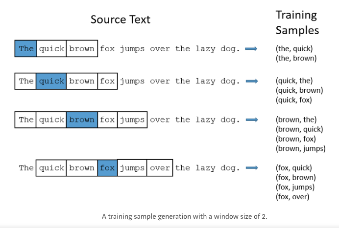

# nlp snippets 

### Word embedding
词嵌入向量将一个单词转换成固定长度的向量表示，从而便于进行数学处理。
- WordEmbedding矩阵给每个单词分配一个固定长度的向量表示，这个长度可以自行设定，比如300，实际上会远远小于字典长度（比如10000）。而one-hot表示方法中，单词对应的向量长度等于字典长度，占用空间过大。
- WordEmbedding矩阵中两个单词向量之间的夹角值可以作为他们之间关系的一个衡量。而one-hot表示方法无法体现单词的相关性关系。

词嵌入向量可以通过*word2vec*模型训练生成。

### word2vec model
#### 基本原理
Word2Vec就是把单词转换成向量。它本质上是一种单词聚类的方法，是实现单词语义推测、句子情感分析等目的一种手段。
- CBOW是从输入的上下文信息来预测目标词(例如利用 [the cat sits on the] 来预测 [mat] )
- skip-gram模型则是相反的，从目标词来预测上下文信息。

*word2vec* 模型是一个三层神经网络结构。以skip-gram模型为例
- 建立三层网络：一个输入层，一个隐藏层和一个输出层。
- 输入一系列单词，用于预测周围的单词（上下文），并进行参数优化。
- 去掉最后一个输出层。
- 输入字典中的任意单词，隐藏层输出的向量便是该单词的词嵌入向量。

输入层到隐藏层的矩阵运算和维度变化可参加下图。

#### 训练样本设置
以skip-gram模型为例，模型需要设置一个参数*window_size*，假设其为n，表示以当前词为中心，需要预测前n个以及后n个单词，以此构成训练样本。具体可参考下面的图片。

### TF-IDF(Term Frequency-Inverse Document Frequency, 词频-逆文件频率)
一个词语在一篇文章中出现次数越多, 同时在所有文档中出现次数越少, 越能够代表该文章。
- 词频 (term frequency, TF)  指的是某一个给定的词语在该文件中出现的次数。这个数字通常会被归一化(一般是词频除以文章总词数), 以防止它偏向长的文件。（同一个词语在长文件里可能会比短文件有更高的词频，而不管该词语重要与否。）
- 逆向文件频率 (inverse document frequency, IDF)  IDF的主要思想是：如果包含词条t的文档越少, IDF越大，则说明词条具有很好的类别区分能力。某一特定词语的IDF，可以由总文件数目除以包含该词语之文件的数目，再将得到的商取对数得到。

### 计算句子的相似度
从大类上分，计算句子相似度的方法可以分为两类：
1）无监督的方法，即不使用额外的标注数据，常用的方法有：
- 对句子中所有词的word vector求平均，获得sentence embedding
- 以每个词的tf-idf为权重，对所有词的word vector加权平均，获得sentence embedding
- 以smooth inverse frequency[1]（简称SIF)为权重，对所有词的word vector加权平均，最后从中减掉principal component，得到sentence embedding
- 通过Word Mover’s Distance[2]（简称WMD），直接度量句子之间的相似度2）
  
有监督的方法，需要额外的标注数据，常见的有监督任务有：
- 分类任务，例如训练一个CNN的文本分类器[3]，取最后一个hidden layer的输出作为sentence embedding，其实就是取分类器的前几层作为预训练的encoder。
- sentence pair的等价性/等义性判定（[4][5]），这种方法的好处是不仅可以得到sentence embedding，还可以直接学习到距离度量函数里的参数

### Reference 
- [白话word2vec](https://zhuanlan.zhihu.com/p/36312907)
- [nlp---TF-IDF原理及使用](https://blog.csdn.net/u011630575/article/details/80179494)
- [词嵌入向量WordEmbedding的原理和生成方法](https://www.jianshu.com/p/0bb00eed9c63)
- [Learn Word2Vec by implementing it in tensorflow](https://towardsdatascience.com/learn-word2vec-by-implementing-it-in-tensorflow-45641adaf2ac)