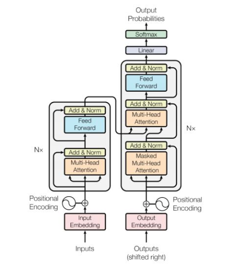
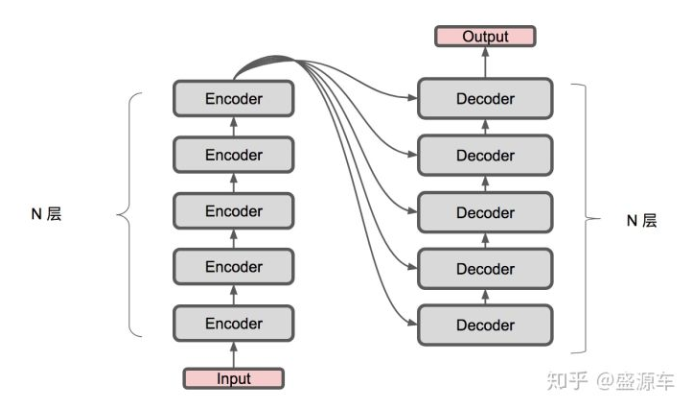

# Transformer model

### 基本结构 
transformer的结构也是由encoder和decoder组成。

#### Encoder
Encoder由N=6个相同的layer组成，layer指的就是上图左侧的单元，最左边有个“Nx”，这里是x6个。每个Layer由两个sub-layer组成，分别是
- multi-head self-attention mechanism。
  multi-head attention 是通过$$n$$个不同的线性变化进行投影，然后将不同的attention结果拼接起来
  $$ Multi-Head(Q, K, V) = concat(h_1, h_2, ..h_n) W$$

  $$h_i = attention(QW^q_i, KW^k_i, VW^v_i$$

  self-attention的含义是$$Q, K, V$$相同。

- fully connected(pisition-wise) feed-forward network。第二个sub-layer是个全连接层，之所以是position-wise是因为处理的attention输出是某一个位置i的attention输出。

#### Decoder
Decoder比Encoder多了一个attention的sub-layer。
- 输出：对应i位置的输出词的概率分布
- 输入：encoder的输出以及对应i-1位置decoder的输出。所以中间的attention不是self-attention，它的K，V来自encoder，Q来自上一位置decoder的输出
- 解码：编码可以并行计算，一次性全部encoding出来，但解码不是一次把所有序列解出来的，而是像rnn一样一个一个解出来的，因为要用上一个位置的输入当作attention的query

#### Positional Encoding
将encoding后的数据与embedding数据求和，加入了相对位置信息。

### Reference
- [Attention is all you need模型笔记](https://zhuanlan.zhihu.com/p/39034683)