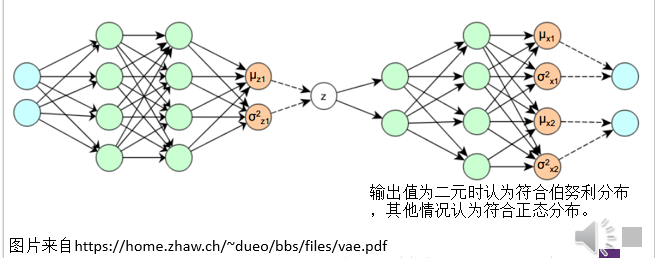
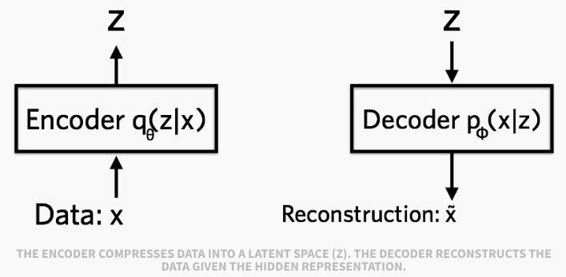
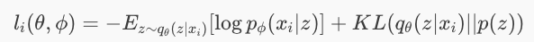

# Variational Autoencoder

### 概述 
- 变分子编码器的结构和传统自编码器的结构最大的区别就是变分子编码器的encoder和decoder输出的都是概率密度函数的参数。
  - latent variable $z$通常假设为正态分布。
  - encoder输出形状为 *(batch_size, 2*latent_dims，其中一半表示$z$的均值，另一半表示方差。

### 模型结构

用$$q_{\theta}(z \vert  x)$$表示encoder的输出分布，用$$p_{\phi}(x\vert z)$$表示decoder的输出分布。

#### 损失函数
单个样本的损失函数分成两部分
- reconsturction loss: decoder学习重建数据分布的对数似然函数的期望。学习的越好，负值越大，损失越小。
- 正则项：$$q_{\theta}(z \vert  x)$$与$$z$$z真实分布(通常是标准正态分布)的KL散度。

#### decoder 输出
- 输入样本为二值型的，decoder 输出服从伯努利分布，输出的是值为1的概率，应该用sigmoid激活函数，让其输出在[0,1]。
- 输入样本为连续类型的， decoder的输出服从正态分布，输出的一半是均值，一半是方差。有时候可能只输出均值。

### Reference 

- [变分自编码器](https://blog.csdn.net/Cyril__Li/article/details/72801124)
- [Tutorial - what is a variational autoencoder](https://jaan.io/what-is-variational-autoencoder-vae-tutorial/)