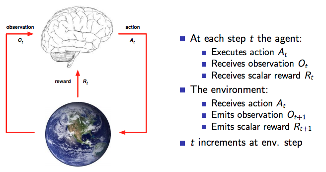
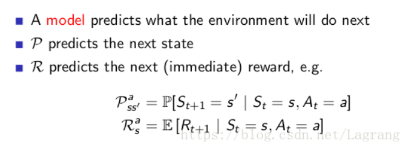

# Q-learning


## 强化学习问题
强化学习问题由下面几个部分组成：
- reward
- agent
- environment
- state
- action

强化学习的目的为选择action用以最大化所有未来的reward(reward之和）。


### Agent and environment
agent与environment的交互过程如下图所示，其中大脑表示agent，地球表示environment。 



### State
强化学习过程中的历史数据由一系列的observation, reward和action组成。

$$H_t=O_1, R_1, A_1, ..., A_{t-1}, O_t,R_t$$

有了历史数据，就可以用于让agent选择action，让environment选择observation和reward。

根据state的定义，state是用来决定下一步做什么的信息量，可以将state看做是history 的函数： 

$$S_t=f(H_t)$$

### Agent 构成要素

一个强化学习的agent主要包括以下一个或多个要素： 
- Policy：agent的行为准则，对应着action和state之间的关系。
    - 确定性策略。定义一个action为state的函数。$$ a=\pi(s) $$。
    - 随机策略。定义action相对state的条件概率。$$\pi(a \vert s)$$。
- Value function: 强化学习的目标为最大化reward之和，但不是每一个学习过程都有终止状态，那么reward之和不能简单计算，所以需要用一个价值函数来估计未来的reward。
- Model: agent’s representation of the environment





### Q-learning Algorithms
#### Q matrix
"Q", to the brain of our agent, representing the memory of what the agent has learned through experience.  The rows of matrix Q represent the current state of the agent, and the columns represent the possible actions leading to the next state

#### Transition

Q(state, action) = R(state, action) + Gamma * Max[Q(next state, all actions)]

- 当前环境下某位置的价值Q可以通过原来的Q和下一步能走的位置的最大值之间进行计算后训练获得。

```python
    while not is_terminated:
        action = choose_actions(s, q_table)
        next_state, reward = get_env_feedback(s, action)
        q_predict = q_table.loc[s, action]
        if next_state != 'terminal':
            q_target = reward + GAMMA * q_table.iloc[next_state, :].max()
        else:
            q_target = reward
            is_terminated = True

        q_table.loc[s, action] += ALPHA * (q_target - q_predict)
        s = next_state
        update_env(s, episode, step_counter + 1)

        step_counter += 1

```


### Deep Q-learning
- 将状态和动作当成神经网络的输入, 然后经过神经网络分析后得到动作的 Q 值, 这样就没必要在表格中记录 Q 值, 而是直接使用神经网络生成 Q 值。
- 也可以只输入状态值, 输出所有的动作值, 然后按照 Q learning 的原则, 直接选择拥有最大值的动作当做下一步要做的动作. 


### Reference
- [A painless q learning tutorial](http://mnemstudio.org/path-finding-q-learning-tutorial.htm)
- [小例子-强化学习](https://morvanzhou.github.io/tutorials/machine-learning/reinforcement-learning/2-1-general-rl/ks)
- [强化学习之q-learning](https://www.jianshu.com/p/1c0d5e83b066)
- [Introduction to Reinforcement Learning](http://www0.cs.ucl.ac.uk/staff/d.silver/web/Teaching_files/intro_RL.pdf)
- [强化学习系列（一）：强化学习简介](https://blog.csdn.net/LagrangeSK/article/details/80943045)