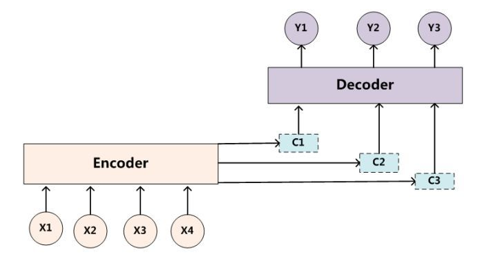
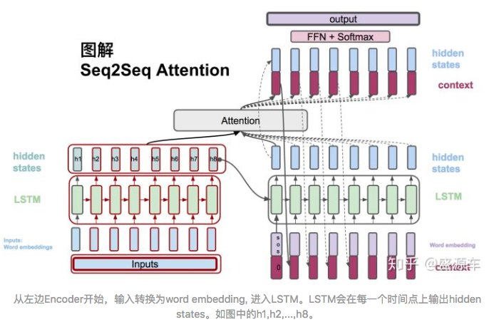
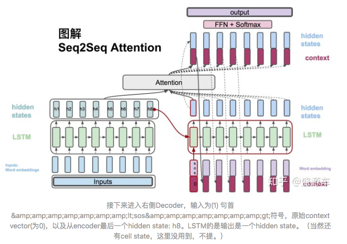
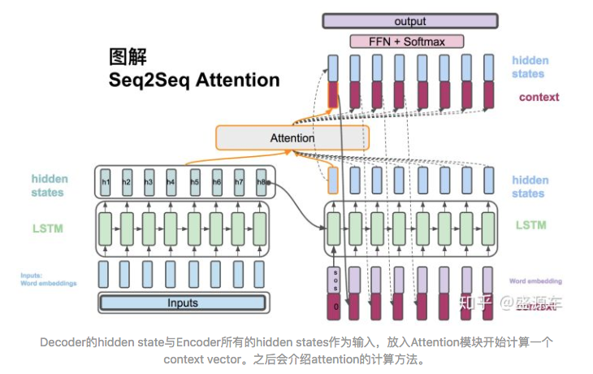
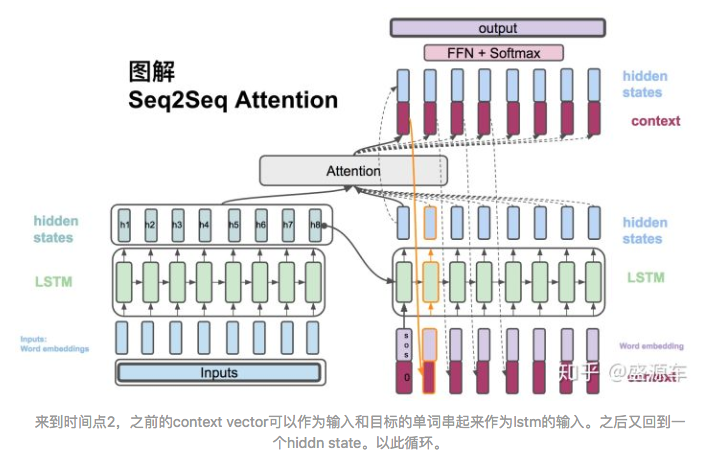
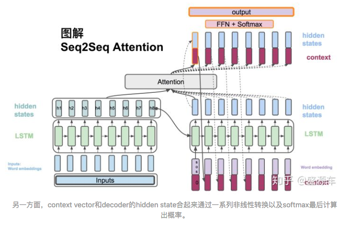

# Attention model 

### 基本原理

#### 与传统Encoder/Decoder模型比较
以机器翻译来作为例子。当给出一句‘我爱你’(source)中文，要将它翻译成英文‘I love you’(target)时，利用现在深度学习最为流行的model--encoder to decoder，‘我爱你’被编码(这里指语义编码)成$$C$$，然后在经过非线性函数$$g$$来decoder得到目标Target中的每一个单词$$y_1$$,$$y_2$$,$$y_3$$。计算如下： 

$$C = f(x_1,x_2,x_3)$$ 
$$y_1 = g(C)$$ 
$$y_2 = g(C,y_1)$$ 
$$y_3 = g(C,y_1,y_2)$$ 

这样的过程称之为一个分心模型。因为
- source中每一个元素对语义编码C的作用是相同的，也就是每一个元素的重要程度都是一样的。
- 实际上，‘我’这个元素对target中的'I'的结果是影响最大的，其他元素的影响可以说是微乎其微。但是在上述模型中，这个重要程度没有被体现出来。

注意力模型就是要从序列中学习到每一个元素的重要程度，然后按重要程度将元素合并.
- 这就表明了序列元素在编码的时候，所对应的语义编码C是不一样的。
- 此时的$C$不再是$x1,x2,x3$简单的encoder，而是成为了各个元素按其重要度加权求和得到的。
  
  $$C_i = \sum_{j=0}^{T_x}a_{ij}f(x_j)$$
    其中i表示时刻，j表示序列中第j个元素，$T_x$表示序列的长度，$f(x_j)$表示元素$x_j$的编码。
- 结构可见下图。
  

#### 计算步骤

输入: $$x = (x_1, x_2,..., x_{T_x}) $$
输出: $$y = (y_1, y_2,..., y_{T_y}) $$

1. $$h_t = RNN_{Encoder}(x_t, h_{t-1})$$: Encoder方面接受的是每一个单词word embedding，和上一个时间点的hidden state。输出的是这个时间点的hidden state。见下图。
   

2. $$s_t = RNN_{Decoder}(\hat{y}_{t-1}, s_{t-1})$$: Decoder方面接受的是目标句子里单词的word embedding，和上一个时间点的hidden state。见下图。
   

3. $$C_i = \sum_{j=0}^{T_x}a_{ij}h_j$$: context vector是一个对于encoder输出的hidden states的一个加权平均。
4. $$a_{ij} = \frac{\exp{e_{ij}}{\sum_{k=1}^{T_x} \exp{e_{ik}}}$$:每一个encoder的hidden states对应的权重。
5. $$e_{ij}=score(s_i, h_i)$$, 通过decoder的hidden states加上encoder的hidden states来计算一个分数，用于计算权重(4)。
   

6. 在下一个时间点，$$\hat{s}_t=tanh(W_c[c_t;s_t])$$: 将context vector 和 decoder的hidden states 串起来。

7. $$P(y_t \vert y_{<t}, x) =softmax(W_s \hat{s_t})$$: 计算最后的输出概率。

### Reference
- [真正的完全图解Seq2Seq Attention模型](https://zhuanlan.zhihu.com/p/40920384)
- [浅谈Attention机制的理解](https://zhuanlan.zhihu.com/p/35571412)