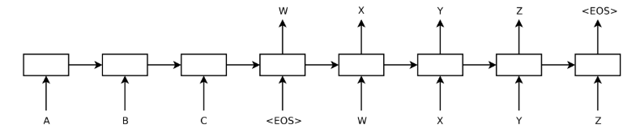

# Seq2Seq forward-only encoder / decoder without attention.

### 网络结构

本文使用如下机器翻译的流程结构



- 长方形表示 Encoder 和  Decoder 单元结构。
- Encoder接收到序列[A, B, C]作为输入。
- 我们不关心Encoder的输出，故不在图中显示。Encoder的隐层最后输出到Decoder。
- Decoder的输入序列为[< EOS>, W, X, Y, Z]，训练后输出序列[W, X, Y, Z, < EOS>]。 


#### 词序列定义
序列输入通常是一个矩阵，如 [max_time, batch_size] (也可以反过来)。如果序列长度不足的话以零替代。

```
# raw input sequences
x = [[5, 7, 8], [6, 3], [3], [1]]

# after using some sort of batch function
xt, xlen = helpers.batch(x)

x
array([[5, 6, 3, 1],
       [7, 3, 0, 0],
       [8, 0, 0, 0]], dtype=int32)
xt
[3, 2, 1, 1]
```


### 模型的运行流程 
#### 模型的输入

需要定义三个placeholder
- encoder_inputs: shape [encoder_max_time, batch_size]
- decoder_targets: shape [decoder_max_time, batch_size]
- decoder_inputs: shape [decoder_max_time, batch_size]
  - 一般来说不需要手动传递数据给decoder_inputs，通常是前一步的decoder_targets或者其他方式。
  - decoder_inputs和decoder_targets必须有同样的decode_max_time。

```python
encoder_inputs = tf.placeholder(shape=(None, None), dtype=tf.int32, name='encoder_inputs')
decoder_targets = tf.placeholder(shape=(None, None), dtype=tf.int32, name='decoder_targets')
decoder_inputs = tf.placeholder(shape=(None, None), dtype=tf.int32, name='decoder_inputs')
```

#### 词向量转化

经过词向量转化，encoder_inputs和decoder_inputs的size由 [max_time, batch_size] 变成 [max_time, batch_size, input_embedding_size]

```python
# 初始化一个随机的词嵌入矩阵，后面优化过程中自行去学习
embeddings = tf.Variable(tf.random_uniform([vocab_size, input_embedding_size], -1.0, 1.0), dtype=tf.float32)

encoder_inputs_embedded = tf.nn.embedding_lookup(embeddings, encoder_inputs)
decoder_inputs_embedded = tf.nn.embedding_lookup(embeddings, decoder_inputs)
```

#### Encoder

```python
encoder_cell = tf.contrib.rnn.LSTMCell(encoder_hidden_units)

encoder_outputs, encoder_final_state = tf.nn.dynamic_rnn(
    encoder_cell, encoder_inputs_embedded,
    dtype=tf.float32, time_major=True,
)

del encoder_outputs

```
encoder_final_state 是一个tuple
- encoder_final_state.h 是隐层的激活值。
- encoder_final_state.c 是最后的输出。
  

#### Decoder 

```python
decoder_cell = tf.contrib.rnn.LSTMCell(decoder_hidden_units)

decoder_outputs, decoder_final_state = tf.nn.dynamic_rnn(
    decoder_cell, 
    decoder_inputs_embedded,
    initial_state=encoder_final_state,
    dtype=tf.float32, 
    time_major=True, 
    scope="plain_decoder",
)
```
- decoder_outputs: shape [max_time, batch_size, decoder_hidden_units]。
- 通过一个全连接层，把最后一个维度变成vocab_size。然后才能给出预测值。

```python
decoder_logits = tf.contrib.layers.linear(decoder_outputs, vocab_size)

decoder_prediction = tf.argmax(decoder_logits, 2)
```
#### 优化

```python 
stepwise_cross_entropy = tf.nn.softmax_cross_entropy_with_logits(
    labels=tf.one_hot(decoder_targets, depth=vocab_size, dtype=tf.float32),
    logits=decoder_logits,
)

loss = tf.reduce_mean(stepwise_cross_entropy)
train_op = tf.train.AdamOptimizer().minimize(loss)
```


### Reference
- [Simple dynamic seq2seq with TensorFlow](https://github.com/ematvey/tensorflow-seq2seq-tutorials/blob/master/1-seq2seq.ipynb)