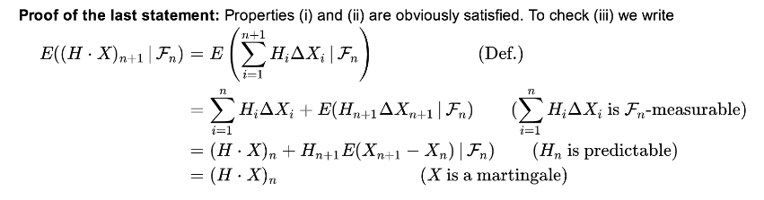
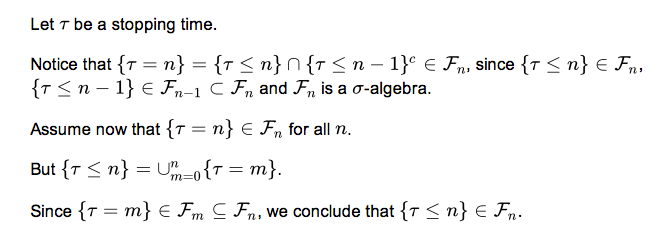
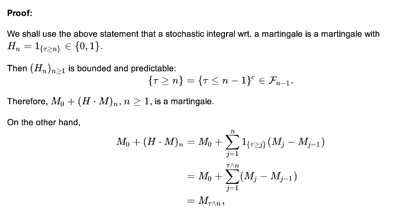

# Stochastic process in discrete time

Let $$(\Omega, \mathcal{F}, \mathbb{P})$$ be a probability space.

## Filtration
### Stochastic process
A collection of random variables $$X:=(X_n)_{n \ge 0}$$ is called a (discrete time) *stochastic process*.

### Filtration
A non­decreasing sequence of $$\sigma$$-algebras $$\mathcal{F}_0 \subseteq \mathcal{F}_1 \subseteq ...\subseteq  \mathcal{F}_n \subseteq ... \subseteq \mathcal{F}$$ is called a *filtration*.

Let $$X:=(X_n)_{n \ge 0}$$ be a sequence of r.v.s. Let $$\mathcal{F}_n=\sigma(X_0, X_1, ..., X_n)$$, $$n \ge 0$$. The filtration $$(\mathcal{F_n})_{n \ge 0}$$ is called the natural filtration of $$X$$.

#### Filtered probability space
The probability space $$(\Omega, \mathcal{F}, \mathbb{P})$$ equipped with a filtration $$(\mathcal{F_n})_{n \ge 0}$$ denoted $$(\Omega, \mathcal{F_n}, \mathbb{P})$$ by *filtered probability space*.

#### Adapted to filtration
A stochastic process $$X$$ is called *adapted* to the filtration $$(\mathcal{F_n})_{n \ge 0}$$ if $$X_n$$ is a $$\mathcal{F_n}$$ - measurable for every $$n \ge 0$$.

## Martingales
Let $$(\Omega, \mathcal{F_n}, \mathbb{P})$$ be a filtered probability space. A stochastic process $$X$$ is called a martingale(submartingale, supermartingale) with respect to the filtration $$(\mathcal{F_n})_{n \ge 0}$$ if it satisfies
- $$\mathbb{E} \vert X_n \vert < \infty, \forall n \ge 0$$.
- $$X$$ is adapted to $$(\mathcal{F_n})_{n \ge 0}$$.
- $$\mathbb{E} [ X_{n+1} \vert \mathcal{F_n} ]=(\ge, \le)X_n, \forall n \ge 0$$. 

### Basic Properties of martingales
- For $$m > n$$,
  - if $$X$$ is a martingale, then $$\mathbb{E}[X_m \vert F_n] = X_n$$.
  - if $$X$$ is a submartingale, then $$\mathbb{E}[X_m \vert F_n] \ge X_n$$.
  - if $$X$$ is a supermartingale, then $$\mathbb{E}[X_m \vert F_n] \le X_n$$.
- if $$X$$ is a martingale, then $$\mathbb{E}(X_m) = \mathbb{E}(X_0),  \forall n \ge 0$$

#### Proof of the second property
Because of the tower property of conditional expectation, we have 
$$\mathbb{E}(X_m) = \mathbb{E} [\mathbb{E}[X_m \vert F_0]]$$.

Because $$X$$ is a martingale, then $$\mathbb{E} [\mathbb{E}[X_m \vert F_0]]= \mathbb{E} (X_0)$$.

Finally we have $$\mathbb{E}(X_m)=\mathbb{E}(X_0)$$.

### Predictable process

#### Definition 
A stochastic process $$H$$ is called *predictable* if $$H_n$$ is $$\mathcal{F}_{n-1}$$ measureable for every $$n \ge 1$$. Note that as a convention we do not define $$H_0$$.

#### Doob's decomposition theorem
Any submartingale(supermartingale) $$X$$ can ben written in a unique way as $$X_n=M_n+A_n$$, where $$M$$ is a martingale and $$A$$ is a predictable and increasing(decreasing) sequence with $$A_0=0$$.

### Discrete stochastic integral 

#### Definition 
The stochastic integral of the predictable process $$H$$ with respect to a process $$X$$, denoted by $$H \cdot X$$, is defined as 

$$
\left \langle H \cdot X  \right \rangle_n  = \sum_{i=1}^n H_i \Delta X_i
$$
where $$\Delta X_i=X_i - X_{i-1}$$

As a convetion we define $$\left \langle H \cdot X  \right \rangle_0=0$$ 

#### Properties of the stochastic integral
- Let $$X$$ be a supermartingale(submartingale) and $$H$$ be nonnegative, bounded and predicatable. Then $$H\cdot X$$ is a supermartingale(submartingale).
- Let $$X$$ be a submartingale. Supoose $$H$$ and $$K$$ are bounded and predicatable such that $$H_n \ge K_n \forall n \ge 0$$, then 
$$
\mathbb{E} \left[\left \langle H \cdot X  \right \rangle_n \right] \ge \mathbb{E} \left[\left \langle H \cdot X  \right \rangle_n \right]
$$

- Let $$X$$ be a martingale and $$H$$ be bounded and predictable(need not be nonnegative), then $$H \cdot X$$ is a martingale.

### Stopping time
A random variable $$\tau: \Omega \rightarrow \mathbb{N} \cup \{ \infty \}$$ is called a stopping time if $$\{\tau \le n \} \in \mathcal{F}_n$$ for all $$n \in \mathbb{N}$$.
This means that one can determine whether or not $$\{\tau \le n \}$$ on the basis of all the information up to time $$n$$, i.e. $$\mathcal{F}_n$$. $$\tau$$ does not "look into the future" to decide whether or not to stop at time less than or equale to n.
   
#### Theorem 
The r.v. $$\tau$$ is a stopping time iff $$\{\tau = n\} \in \mathcal{F}$$ for all $$n \ge 0$$.

#### Proof of the theorem

#### Lemma 
If $$\tau_1, \tau_2$$ are stopping times so are $$\tau_1 \wedge \tau_2:= \min(\tau_1, \tau_2), \tau_1 \vee \tau_2:= \max(\tau_1, \tau_2), \tau_1 + \tau_2$$.

### Stopped process
#### Theorem 
Let $$M_n$$ be an $$\mathcal{F}_n$$ (sub-, super-)martingale and $$\tau$$ be an $$\mathcal{F}_n$$ stopping time. Then $$M_{n \wedge \tau}$$ is an $$\mathcal{F}_n$$ (sub-, super-)martingale

### Optional stopping theorem (bounded stopping time)
Let $$\tau$$ be a stopping time and $$M$$ be a martingale wrt. the filtration $$\left(\mathcal{F}_n \right)_{n\ge 0}$$.

If there is a constant $$K \in \mathbb{N}$$ such that $$\tau \le K$$ a.s. then 

$$
\mathbb{E} (M_{\tau}) = \mathbb{E}( M_0)
$$

#### Proof of the theorem
Since $$M$$ is a martingale, then $$\left( M_{\tau \wedge n} \right)_{n \ge 0}$$ is a martingale as well.

For martingales we know that for all $$n \ge 0$$,

$$
\mathbb{E} (M_{\tau \wedge n}) = \mathbb{E}(M_0)
$$

Note also for $$n\ge K$$, we have $$\tau \wedge n = \tau$$, hence for all $$n \ge K$$

$$
M_{\tau \wedge n} = M_{\tau}
$$

Therefore 

$$
\mathbb{E}(M_{\tau})= \mathbb{E}(M_0)
$$

#### Application

### Reference 
- [Stochastic Calculs](https://github.com/hongchaopan/MTH9831-Stochastic-Calculus)